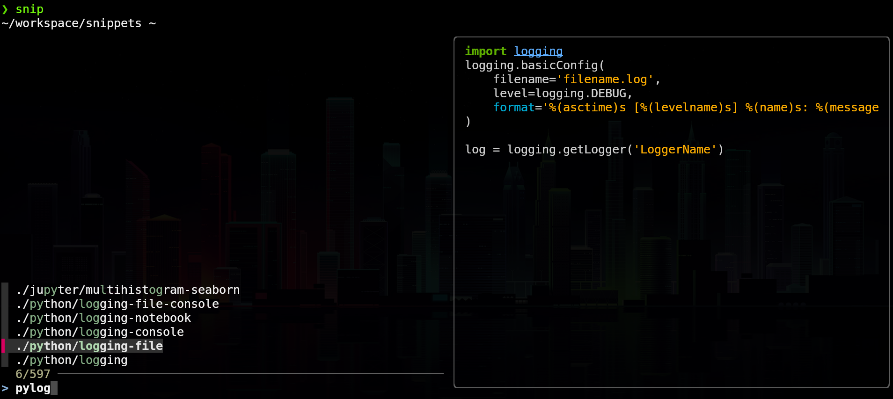

# FZF-powered snippets

Snip is simple script that uses fzf to make it easy to search through your snippet files.
Once you select the snippet file it will either:

* by default copy the snippet into your clipboard
* if called with the `-c` flag - copy the snippet file (or directory) to your present location

## Install

Set `$SNIPPETS` environment variable to point at your snippets directory.
Make sure snip script is on your `$PATH`.

## Dependencies

* [fzf](https://github.com/junegunn/fzf)
* [xclip](https://github.com/astrand/xclip)

Optional:

* [pygmentize](https://pygments.org/docs/cmdline/) (recommended)

Or:

* [bat](https://github.com/sharkdp/bat)

